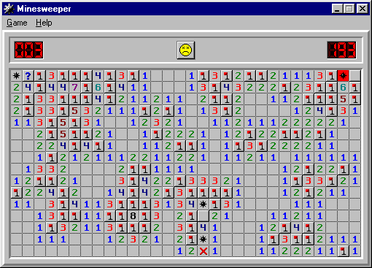

# Minesweeper-2023
> ACM 班 2023 级程序设计第一次大作业

~~大作业~~ 扫雷，启动！

## 简介
### 背景

Minesweeper（扫雷）是我们熟悉的经典轻量级小游戏，作为老版本 Windows 操作系统的内置应用，它在许多人的回忆中可能是学生时代在老电脑里的娱乐，信息课上的摸鱼或是竞赛中垃圾时间的消遣。



自从 Windows 8 从内置游戏中移除了扫雷，关于扫雷的回忆可能已经随我们的那段童年一起被慢慢地尘封。那么在这里，在你初入 ACM 班的第一个大作业中，让我们来回顾一下扫雷吧～

### 作业目标

我们想通过本次作业达到以下目标：
1. 基础任务
   - 熟悉基本的输入输出与控制流语句
   - 熟悉函数的使用
   - 熟悉数组的使用
   - 边界情况的处理
   - 规范代码风格
2. 进阶任务
   - 熟悉函数的递归
   - 了解搜索算法
   - 使用 git 与 cmake 管理项目
3. 挑战任务
   - 提高模拟水平
   - 运用算法解决实际问题的能力

## 作业要求

在本次作业中，你的基础任务是模拟实现一个命令行交互的扫雷小游戏（如果你不知道扫雷小游戏是什么，你可以参考 [扫雷_百度百科](https://baike.baidu.com/item/扫雷/12543) ）。

### 术语解释
由于本次作业涉及到一些为了方便表述而使用的术语，我们会先进行解释
- 地图，格子：在上面的游戏截图中，每一个小方块被我们称为一个格子，所有的格子构成地图
- 访问一个格子：在游戏最开始，所有格子都是**未被访问**的（即其内容对于用户是未知的），用户访问一个格子相当于传统扫雷游戏中左键单击该格子，其状态将变为已访问。
- 地雷：若一个格子是地雷，则访问该格子将**立即**导致游戏失败，否则游戏继续，直到所有非地雷的格子均被访问（即游戏胜利）。
- 非地雷格子的地雷计数：若一个格子不是地雷，则我们将其周围八个格子中地雷的总数称为其地雷计数。

### 作业任务

#### 基础任务

首先，你会通过标准输入得到给定地图的信息（行列数量与每个格子是否为地雷），形式化地，第一行输入两个整数 `n` `m`，代表地图有 `n` 行 `m` 列，随后 `n` 行，每行输入 `m` 个字符（不计换行符），以换行符结尾，其中第 `i` 行第 `j` 列（0-based，下同）代表地图中第 `i` 行第 `j` 个格子的内容，`.` 代表未放置地雷，`@` 代表放置地雷。

例如下面的输入
```
3 3
.@.
@..
..@
```
代表当前游戏的地图大小为 3 * 3，在地图的第 1 行第 2 列，第 2 行第 1 列与第 3 行第 3 列放置了地雷。

在初始状态下，地图中的所有格子都是未被访问的。

随后，你会通过标准输入得到若干行字符串来表示玩家的操作，每一行可能为下面几种操作之一：

1. 玩家访问某个格子
   - 输入形如 `visit a b`，其中 `a` `b` 分别是两个在 `[1, n]` 和 `[1, m]` 范围的正整数
   - 对于访问操作，若该格子没有放置地雷，你应当将该格子从未访问状态更改为已访问状态（若本身就是已访问状态，不做任何操作）；若该格子放置了地雷，你应当立即
2. 玩家要求查看地图状态
   - 输入为 `print`
   - 输出地图，格式与输入相仿，具体地
     - 输出 `n` 行 `m` 列，最后输出换行符
     - 未被访问的格子输出为 `.`，例如上面的地图在初始状态下的输出应该为
        ```
        ...
        ...
        ...
        ```
     - 对于已被访问过的格子，若其为地雷，输出 `@`，若其不是地雷，输出一个正整数 `k`，表示其地雷计数，例如对于上面的地图，若从左到右访问了最下面一行的格子，在右下角的地雷被访问后的输出应当为
        ```
        ...
        ...
        12@
        ```
3. 玩家要求结束游戏
   - 输入为 `quit`
   - 结束游戏的输出见下

若**玩家结束游戏，游戏失败或游戏胜利**，应输出地图状态（相当于执行 `print`），并输出一行两个整数 `visit_count step_count`，以空格分隔，分别代表玩家访问过的**非地雷格子**的个数与总操作数。

#### 进阶任务

待定

### 数据范围

待定

## 评分规则

待定